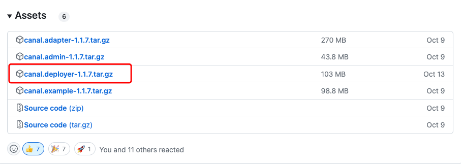
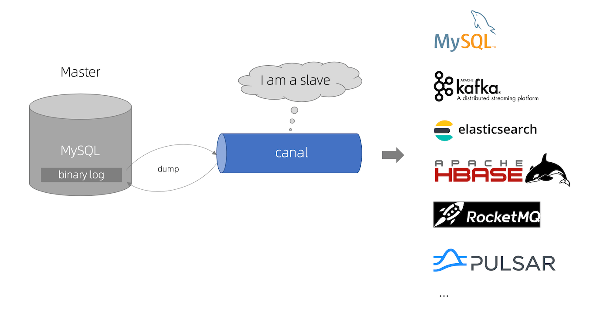

canal 是阿里开源的一款 MySQL 数据库增量日志解析工具，提供增量数据订阅和消费。
使用Canal能够实现异步更新数据，配合MQ使用可在很多业务场景下发挥巨大作用。

文档参考：https://www.liwenzhou.com/posts/Go/canal/
服务端：https://github.com/alibaba/canal
客户端：https://github.com/withlin/canal-go

# server端部署
打开官方release页面，根据需要选择对应的软件包下载即可。
https://github.com/alibaba/canal/releases

将下载后的软件包解压，可看到以下目录。
bin
conf
lib
logs

修改配置文件：canal-server/conf/example/instance.properties。
将canal.instance.master.address修改为你的MySQL地址。
将canal.instance.tsdb.dbUsername修改为你上面授权的账号。
将canal.instance.tsdb.dbPassword修改为你上面授权账号的密码。
注：把canal.properties中zk相关配置注视掉，否则会报zk相关错误

启动：./bin/startup.sh
关闭：./bin/stop.sh